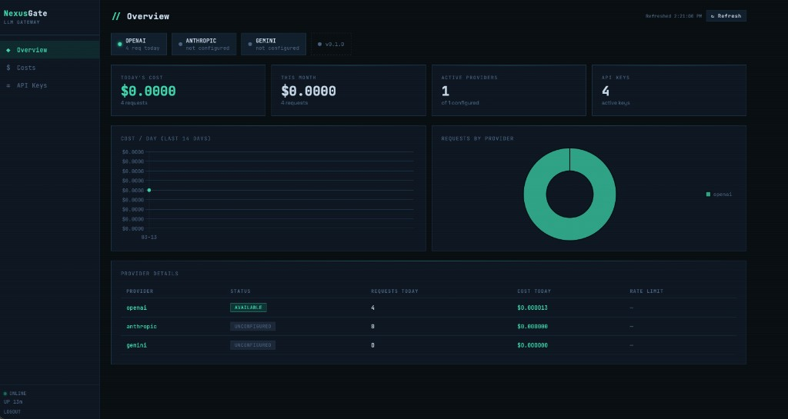
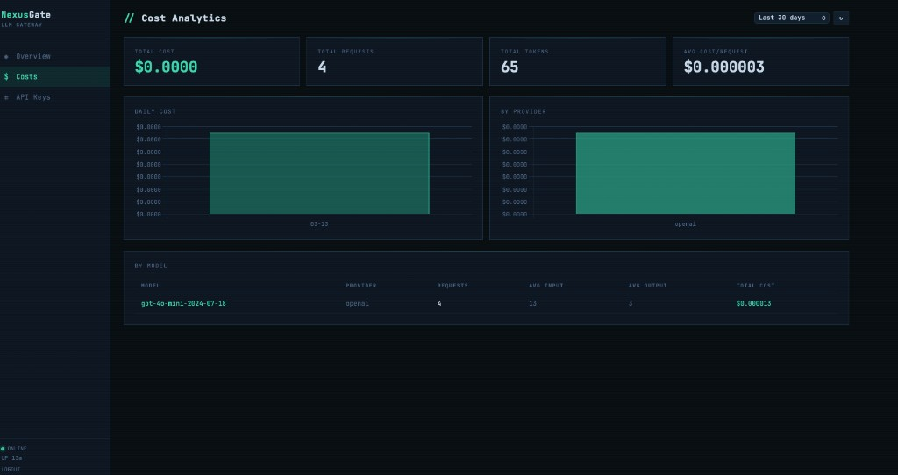

# NexusGate

[](LICENSE)
[](https://www.rust-lang.org/)
[](docker-compose.yml)

**Stop vendor lock-in. One API key. Every LLM provider. Full cost control.**

NexusGate is a drop-in OpenAI-compatible proxy that routes to OpenAI, Anthropic, and Google Gemini — with budget enforcement, automatic rate-limit fallback, and per-key spend tracking. Point your existing OpenAI SDK at it and gain multi-provider resilience with zero code changes.

```
Your App  ──►  NexusGate  ──►  OpenAI
                           ──►  Anthropic   ← automatic fallback on 429
                           ──►  Gemini      ← automatic fallback on budget
```

---

## Why NexusGate?

| Problem | NexusGate fix |
|---|---|
| OpenAI goes down or rate-limits you | Auto-falls back to Anthropic/Gemini — transparently |
| Runaway LLM spend | Hard per-key daily / monthly / total budget caps |
| Multiple teams sharing one API key | Issue isolated keys, each with its own limits |
| No visibility into what LLMs cost | Every response includes exact `cost_usd` |
| Switching providers requires code changes | Zero changes — just point `base_url` at NexusGate |

---

## Quick Start (Docker)

```bash
# 1. Clone and configure
git clone https://github.com/yourname/nexusgate
cd nexusgate
cp .env.example .env
# Edit .env — set ADMIN_JWT_SECRET and at least one provider key

# 2. Start
docker compose up --build

# 3. Get your admin token
docker compose logs nexusgate | grep -A1 "Admin JWT"

# 4. Open dashboard
open http://localhost:8080
```

## Quick Start (Local, no Docker)

Requirements: Rust (stable), Redis

```bash
# 1. Start Redis
redis-server --port 6379 --daemonize yes

# 2. Configure
cp .env.example .env
# Edit .env

# 3. Run
cargo run

# 4. Open dashboard
open http://localhost:8080
```

---

## 60-Second Integration

No SDK changes required — just swap `base_url`:

```python
from openai import OpenAI

client = OpenAI(
    api_key="ng-your-nexusgate-key",   # key from /admin/keys
    base_url="http://localhost:8080/v1"
)

response = client.chat.completions.create(
    model="gpt-4o",
    messages=[{"role": "user", "content": "Hello!"}]
)

print(response.choices[0].message.content)
print(response.nexusgate)  # → cost, provider, fallback info
```

Every response includes a `nexusgate` metadata field:

```json
{
  "choices": [...],
  "nexusgate": {
    "provider": "anthropic",
    "model_used": "claude-haiku-4-5-20251001",
    "tier": "economy",
    "cost_usd": 0.000023,
    "fallback_used": true,
    "fallback_count": 1,
    "request_id": "550e8400-e29b-..."
  }
}
```

---

## Routing Extensions

Override routing per-request without touching your SDK:

```python
response = client.chat.completions.create(
    model="auto",
    messages=[...],
    extra_body={
        "nexusgate": {
            "tier": "economy",       # economy | standard | premium
            "fallback": True,        # fallback across providers on failure
            "max_cost_usd": 0.01,    # hard per-request cost cap
        }
    }
)
```

---

## Core Features

| Feature | Detail |
|---|---|
| **Drop-in OpenAI API** | Works with any OpenAI-compatible SDK, no code changes |
| **Budget enforcement** | Per-key daily / monthly / total limits, enforced pre-request |
| **Rate limit handling** | Detects 429s, marks providers in Redis, routes around them |
| **Intelligent fallback** | Same tier → cheaper tier → error. Never fails silently |
| **Cost transparency** | Every response includes actual `cost_usd` |
| **Multi-provider** | OpenAI, Anthropic, Gemini — pluggable `LlmProvider` trait |
| **Admin dashboard** | Web UI for keys, spend analytics, and provider health |
| **Secure by default** | Keys stored as SHA-256 hashes, JWT admin auth, non-root container |

---

## Admin Dashboard

Open `http://localhost:8080` after startup. Login with your admin JWT token.

- **Overview** — provider health, today's cost, request count
- **API Keys** — create/revoke keys, set per-key budgets and tier restrictions
- **Costs** — spend breakdown by provider, model, and day (charts)

### Overview



### Cost Analytics



### Get admin token

```bash
curl -X POST http://localhost:8080/admin/token \
  -H "Content-Type: application/json" \
  -d '{"secret": "your-ADMIN_JWT_SECRET"}'
# → {"token": "eyJ..."}

export ADMIN_TOKEN=eyJ...
```

### Manage API Keys

```bash
# Create key with budget
curl -X POST http://localhost:8080/admin/keys \
  -H "Authorization: Bearer $ADMIN_TOKEN" \
  -H "Content-Type: application/json" \
  -d '{
    "name": "production",
    "budget_daily_usd": 5.00,
    "budget_monthly_usd": 100.00,
    "allowed_tiers": ["economy", "standard"]
  }'

# List keys with live spend
curl -H "Authorization: Bearer $ADMIN_TOKEN" \
  http://localhost:8080/admin/keys

# Revoke
curl -X POST http://localhost:8080/admin/keys/{id}/revoke \
  -H "Authorization: Bearer $ADMIN_TOKEN"
```

### Cost Analytics

```bash
# Last 30 days
curl -H "Authorization: Bearer $ADMIN_TOKEN" \
  "http://localhost:8080/admin/costs?days=30"

# Filter by key
curl -H "Authorization: Bearer $ADMIN_TOKEN" \
  "http://localhost:8080/admin/costs?days=7&api_key_id=uuid"
```

### Health check

```bash
curl http://localhost:8080/health
```

---

## Model Catalog

| Model | Provider | Tier | Input $/1M | Output $/1M |
|---|---|---|---|---|
| gemini-2.0-flash | Gemini | economy | $0.075 | $0.30 |
| gpt-4o-mini | OpenAI | economy | $0.15 | $0.60 |
| claude-haiku | Anthropic | economy | $0.25 | $1.25 |
| gemini-2.0-pro | Gemini | standard | $1.25 | $5.00 |
| gpt-4o | OpenAI | standard | $2.50 | $10.00 |
| claude-sonnet | Anthropic | standard | $3.00 | $15.00 |
| o3 | OpenAI | premium | $10.00 | $40.00 |
| claude-opus | Anthropic | premium | $15.00 | $75.00 |

**Fallback example**: `gpt-4o` rate-limited → try `claude-sonnet` → try `gemini-2.0-pro` → fall to economy tier.

---

## Configuration

| Variable | Default | Description |
|---|---|---|
| `ADMIN_JWT_SECRET` | **required** | ≥32 chars for JWT signing |
| `OPENAI_API_KEY` | — | OpenAI key (omit to disable provider) |
| `ANTHROPIC_API_KEY` | — | Anthropic key |
| `GEMINI_API_KEY` | — | Google Gemini key |
| `PORT` | `8080` | HTTP listen port |
| `DEFAULT_MAX_TOKENS` | `4096` | Token cap if client doesn't set one |
| `REQUEST_TIMEOUT_SECS` | `60` | Provider HTTP timeout |
| `MAX_FALLBACK_ATTEMPTS` | `3` | Max provider hops before error |
| `RUST_LOG` | `nexusgate=info` | Log verbosity |

---

## Architecture

```
Client
  │
  ▼
[Auth Middleware]       SHA-256 key hash lookup in SQLite
  │
  ▼
[Budget Enforcer]       Redis counters (fast) + SQLite total (authoritative)
  │
  ▼
[Model Router]          Tier selection, skip rate-limited providers
  │
  ▼
[Provider Adapter]      Format conversion (OpenAI / Anthropic / Gemini)
  │
  ├── 429 → [Rate Limiter] mark Redis, retry next in fallback chain
  │
  ▼
[Cost Recorder]         INCR Redis counters + INSERT cost_records (async)
  │
  ▼
Response + nexusgate metadata
```

**Stack**: Rust + Axum · Redis 7 · SQLite (WAL mode) · Alpine container

---

## Security

- **API keys** — stored as SHA-256 hashes only; raw key shown once at creation, never stored
- **Admin JWT** — HS256 signed with your `ADMIN_JWT_SECRET`; 1-year TTL
- **Container** — runs as non-root user `nexusgate` (UID 1001)
- **No prompt logging** — request contents never persisted; only token counts and cost recorded
- **Redis** — rate limit state only; no sensitive data

---

## Repository Layout

```
nexusgate/
├── src/
│   ├── main.rs              # Startup, migrations, server bind
│   ├── config.rs            # Env configuration
│   ├── models.rs            # All types + model catalog + pricing
│   ├── state.rs             # Shared AppState
│   ├── auth.rs              # Key middleware, JWT, key generation
│   ├── budget.rs            # Budget check + cost recording
│   ├── rate_limit.rs        # Redis rate limit state + exponential backoff
│   ├── router.rs            # Model selection + fallback chain
│   ├── error.rs             # OpenAI-compatible error responses
│   ├── api/
│   │   ├── mod.rs           # Axum router
│   │   ├── chat.rs          # POST /v1/chat/completions
│   │   ├── admin.rs         # Keys + cost analytics
│   │   └── health.rs        # GET /health
│   └── providers/
│       ├── mod.rs           # LlmProvider trait
│       ├── openai.rs
│       ├── anthropic.rs
│       └── gemini.rs
├── migrations/001_init.sql
├── dashboard/index.html     # Single-file dashboard (no build step)
├── Dockerfile               # Multi-stage: builder → debian-slim
├── docker-compose.yml
└── .env.example
```

---

## Adding a Provider

```rust
// src/providers/myprovider.rs
#[async_trait]
impl LlmProvider for MyProvider {
    async fn complete(&self, req: &ProviderRequest) -> Result<ProviderResponse> {
        // Convert → call → normalize
        // Return Err with message "RATE_LIMITED:{secs}" on 429
    }
}
```

Then add models to `model_catalog()` in `models.rs` and wire in `build_provider()` in `api/chat.rs`.

See [CONTRIBUTING.md](CONTRIBUTING.md) for full setup and contribution guide.

---

## Contributing

Contributions welcome! See [CONTRIBUTING.md](CONTRIBUTING.md) for how to get started.

Good first issues:
- Add a new LLM provider (Cohere, Mistral, etc.)
- Add streaming support (`stream: true`)
- Add integration tests
- Improve dashboard UX

---

## License

Apache-2.0 — see [LICENSE](LICENSE) for details.

---

> **Suggested GitHub topics** (add via repo Settings → Topics):
> `llm` `openai` `anthropic` `gemini` `llm-gateway` `proxy` `rust` `cost-management` `rate-limiting` `fallback` `openai-compatible` `self-hosted`
